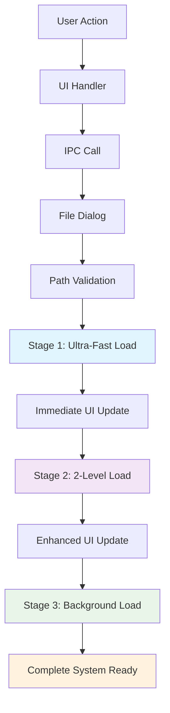

# Folder Opening Workflow Documentation

## Overview

This document provides a comprehensive guide to the complete folder opening workflow in the IDE, covering every step from user interaction to final system state. The workflow is designed for **instant UI response** while providing **complete functionality** through a sophisticated 3-stage loading system.

## 🔄 Complete Workflow Overview



## Phase 1: User Interaction & Trigger

### 1.1 User Initiation Methods

**Menu Option:**

- User clicks **File → Open File or Folder**
- Keyboard shortcut: **Ctrl+O** (Windows/Linux) or **Cmd+O** (macOS)

**Direct Button:**

- "Open Folder" button in the UI
- Welcome screen folder selection

### 1.2 Application Menu Handler

```typescript
// src/index.ts - createMenu()
{
  label: 'Open File or Folder...',
  accelerator: 'CmdOrCtrl+O',
  click: async () => {
    if (mainWindow) {
      mainWindow.webContents.send('menu-open-file');
    }
  },
}
```

**What happens:**

- Electron menu receives click/keyboard event
- Sends `menu-open-file` IPC message to renderer process
- No dialog shown yet - this is just the trigger

### 1.3 Renderer Process Event Handling

```typescript
// src/sections/content.tsx
useEffect(() => {
  const unsubscribeOpenFile = window.electron.onMenuOpenFile?.(() => {
    handleOpenFolder(); // Triggers the actual folder opening
  });

  return () => unsubscribeOpenFile?.();
}, []);
```

**What happens:**

- Renderer process receives IPC event
- Calls `handleOpenFolder()` function
- Initiates the actual folder opening sequence

## Phase 2: Hook-Based Operation Management

### 2.1 Project Operations Hook

```typescript
// src/shared/hooks.ts - useProjectOperations()
const openFileOrFolder = useCallback(async () => {
  try {
    const result = await window.electron.openFileOrFolder(); // Main IPC call

    if (!result) {
      return null; // User cancelled or error
    }

    if (result.type === 'folder') {
      dispatch(setFolderStructure(result.folder)); // Update Redux state
      console.log('Folder opened:', result.folder.name);
      return { type: 'folder', data: result.folder };
    }

    return null;
  } catch (error) {
    console.error('Error opening file or folder:', error);
    throw error;
  }
}, [dispatch]);
```

**What happens:**

- Hook makes IPC call to main process
- Awaits result from file system operations
- Updates Redux state with folder structure
- Handles errors gracefully

### 2.2 IPC Bridge (Preload)

```typescript
// src/preload.ts
openFileOrFolder: async () => {
  try {
    const result = await ipcRenderer.invoke('open-file-or-folder');
    return result;
  } catch (error) {
    console.error('Error in openFileOrFolder preload:', error);
    throw normalizeError(error);
  }
};
```

**What happens:**

- Secure bridge between renderer and main process
- Normalizes errors for consistent handling
- Returns structured result to hook

## Phase 3: Main Process Dialog & Validation

### 3.1 IPC Handler Registration

```typescript
// src/index.ts
ipcMain.handle('open-file-or-folder', async () => {
  // Complete folder opening implementation
});
```

### 3.2 Native File Dialog

```typescript
const result = await dialog.showOpenDialog(mainWindow, {
  properties: ['openFile', 'openDirectory'],
  title: 'Select File or Directory',
});

console.log('File/Folder dialog result:', result);
```

**What happens:**

- Native OS file dialog opens
- User can select files or directories
- Dialog returns:
  ```typescript
  {
    canceled: boolean,
    filePaths: string[]
  }
  ```

### 3.3 User Selection Handling

```typescript
if (result.canceled || !result.filePaths || result.filePaths.length === 0) {
  console.log('Dialog was cancelled or no paths selected');
  return null; // Graceful cancellation
}

const selectedPath = result.filePaths[0];
console.log('Selected path:', selectedPath);
```

**What happens:**

- Checks if user cancelled dialog
- Extracts selected path from result
- Handles empty selections gracefully

### 3.4 Path Type Validation

```typescript
const stats = fs.statSync(selectedPath);

if (stats.isFile()) {
  // Handle single file opening
  return { type: 'file', file: fileData };
} else if (stats.isDirectory()) {
  // Proceed with folder opening workflow
  return { type: 'folder', folder: folderData };
}
```

**What happens:**

- Uses Node.js `fs.statSync()` to check path type
- Branches to appropriate handler (file vs folder)
- Validates path accessibility

## Phase 4: Stage 1 - Ultra-Fast Initial Loading

### 4.1 Single-Level Tree Building

```typescript
// Load first level instantly for immediate UI response
console.log('⚡ Loading first level (ultra-fast)...');
const startTime = Date.now();
const singleLevelTree = await buildSingleLevelTreeAsync(selectedPath);
const singleLevelTime = Date.now() - startTime;
console.log(`🚀 First level loaded in ${singleLevelTime}ms`);
```

**Performance Target:** 1-5ms

### 4.2 Ultra-Fast Loading Function

```typescript
const buildSingleLevelTreeAsync = async (
  dirPath: string,
): Promise<FileTreeNode[]> => {
  try {
    const items = await fs.promises.readdir(dirPath, { withFileTypes: true });

    // Quick separation and basic sort
    const directories = items
      .filter(item => item.isDirectory())
      .sort((a, b) => a.name.localeCompare(b.name));
    const files = items
      .filter(item => !item.isDirectory())
      .sort((a, b) => a.name.localeCompare(b.name));

    return [...directories, ...files].map(item => {
      const itemPath = path.join(dirPath, item.name);
      return {
        id: itemPath,
        name: item.name,
        parentPath: dirPath,
        path: itemPath,
        isDirectory: item.isDirectory(),
        children: [],
        childrenLoaded: false, // Will be loaded later
        isLoading: false,
        isExpanded: false,
        level: 0,
      };
    });
  } catch (error) {
    console.error(`Error reading directory: ${dirPath}`, error);
    return [];
  }
};
```

**Optimizations:**

- **Async I/O**: `fs.promises.readdir()` for non-blocking reads
- **Minimal Processing**: Basic sorting only
- **No Recursion**: Single level only
- **Lazy Loading**: Children marked as not loaded

### 4.3 Immediate Structure Creation & Storage

```typescript
// Return single-level structure immediately for instant UI response
const initialStructure = {
  name: path.basename(selectedPath),
  root: selectedPath,
  tree: singleLevelTree,
  backgroundLoading: true,
};

// Store the initial structure
store.set(SELECTED_FOLDER_STORE_NAME, initialStructure);

// Return immediately for instant UI response
return {
  type: 'folder',
  folder: initialStructure,
};
```

**What happens:**

- Creates folder structure object
- Stores in Electron Store for persistence
- Marks as `backgroundLoading: true`
- Returns immediately to renderer

## Phase 5: Immediate UI Response

### 5.1 Redux State Update

```typescript
// src/shared/hooks.ts
if (result.type === 'folder') {
  dispatch(setFolderStructure(result.folder));
  console.log('Folder opened:', result.folder.name);
}
```

**What happens:**

- Redux state updated with initial folder structure
- UI components receive new state via selectors
- File tree component re-renders with new data

### 5.2 File Tree Component Update

```typescript
// File tree component receives folderStructure from Redux
const folderStructure = useAppSelector(state => state.main.folderStructure);

// Renders tree immediately with single-level structure
return (
  <TreeContainer>
    {folderStructure.tree.map(node => (
      <TreeNode key={node.id} node={node} />
    ))}
  </TreeContainer>
);
```

**What happens:**

- File tree renders immediately with single-level structure
- Loading indicator shows background loading status
- User sees instant response (1-8ms total)

## Phase 6: Stage 2 - Enhanced 2-Level Loading

### 6.1 Non-Blocking Asynchronous Loading

```typescript
// Immediately start loading second level and then background loading
setImmediate(async () => {
  try {
    // Load 2 levels for better initial tree
    console.log('📁 Loading 2 levels (async)...');
    const twoLevelStart = Date.now();
    const twoLevelTree = await buildInitialFileTreeAsync(selectedPath, 2, 0);
    const twoLevelTime = Date.now() - twoLevelStart;
    console.log(`✅ Two levels loaded in ${twoLevelTime}ms`);
  } catch (error) {
    console.error('2-level loading failed:', error);
  }
});
```

**Performance Target:** 10-50ms

### 6.2 Batched 2-Level Loading Function

```typescript
const buildInitialFileTreeAsync = async (
  dirPath: string,
  maxDepth: number = 2,
  currentDepth: number = 0,
): Promise<FileTreeNode[]> => {
  try {
    const items = await fs.promises.readdir(dirPath, { withFileTypes: true });

    // Process directories and files separately
    const directories: fs.Dirent[] = [];
    const files: fs.Dirent[] = [];

    for (const item of items) {
      if (item.isDirectory()) {
        directories.push(item);
      } else {
        files.push(item);
      }
    }

    // Simple name-only sort for speed
    directories.sort((a, b) => (a.name < b.name ? -1 : 1));
    files.sort((a, b) => (a.name < b.name ? -1 : 1));

    const allItems = [...directories, ...files];
    const nodes: FileTreeNode[] = [];

    // Process items in batches to avoid blocking
    const batchSize = 20;
    for (let i = 0; i < allItems.length; i += batchSize) {
      const batch = allItems.slice(i, i + batchSize);

      for (const item of batch) {
        const itemPath = path.join(dirPath, item.name);
        const node: FileTreeNode = {
          id: itemPath,
          name: item.name,
          parentPath: dirPath,
          path: itemPath,
          isDirectory: item.isDirectory(),
          children: [],
          childrenLoaded: currentDepth < maxDepth,
          isLoading: false,
          isExpanded: false,
          level: currentDepth,
        };

        // For directories within depth limit, load children
        if (item.isDirectory() && currentDepth < maxDepth) {
          try {
            node.children = await buildInitialFileTreeAsync(
              itemPath,
              maxDepth,
              currentDepth + 1,
            );
            node.childrenLoaded = true;
          } catch (error) {
            console.warn(`Cannot read directory: ${itemPath}`, error);
            node.children = [];
            node.childrenLoaded = true;
          }
        }

        nodes.push(node);
      }

      // Yield control after each batch
      if (i + batchSize < allItems.length) {
        await new Promise(resolve => setImmediate(resolve));
      }
    }

    return nodes;
  } catch (error) {
    console.error(`Error reading directory: ${dirPath}`, error);
    return [];
  }
};
```

**Optimizations:**

- **Batched Processing**: 20 items per batch prevents blocking
- **Yielding Control**: `setImmediate()` allows other operations
- **Recursive Loading**: Loads 2 levels deep
- **Error Handling**: Graceful handling of permission issues

### 6.3 Update Storage & Notify Renderer

```typescript
// Update with 2-level tree
const updatedStructure = {
  name: path.basename(selectedPath),
  root: selectedPath,
  tree: twoLevelTree,
  backgroundLoading: true,
};

store.set(SELECTED_FOLDER_STORE_NAME, updatedStructure);

// Notify renderer of the 2-level update
if (mainWindow && !mainWindow.isDestroyed()) {
  mainWindow.webContents.send('tree-initial-update', {
    rootPath: selectedPath,
    tree: twoLevelTree,
  });
}
```

**What happens:**

- Updates stored structure with 2-level tree
- Sends `tree-initial-update` IPC event to renderer
- UI receives enhanced tree structure

## Phase 7: Stage 3 - Complete Background Loading

### 7.1 Background Loading Initiation

```typescript
// Now start complete background loading
console.log('🚀 Starting complete background loading...');
const completeTree = await loadCompleteTreeBackground(
  selectedPath,
  (progress: BackgroundLoadProgress) => {
    // Send progress updates to renderer
    if (mainWindow && !mainWindow.isDestroyed()) {
      mainWindow.webContents.send('tree-loading-progress', {
        rootPath: selectedPath,
        progress,
      });
    }
  },
);
```

### 7.2 Complete Background Loading Function

```typescript
const loadCompleteTreeBackground = async (
  rootPath: string,
  onProgress?: (progress: BackgroundLoadProgress) => void,
): Promise<FileTreeNode[]> => {
  const startTime = Date.now();
  let totalDirectories = 0;
  let loadedDirectories = 0;

  // First pass: count total directories for progress tracking
  const countDirectories = (dirPath: string): number => {
    try {
      const items = fs.readdirSync(dirPath, { withFileTypes: true });
      let count = 0;

      for (const item of items) {
        if (item.isDirectory()) {
          // Skip common directories that we don't want to load
          if (
            item.name.startsWith('.') ||
            item.name === 'node_modules' ||
            item.name === 'dist' ||
            item.name === 'build'
          ) {
            continue;
          }

          count += 1;
          const itemPath = path.join(dirPath, item.name);
          count += countDirectories(itemPath);
        }
      }
      return count;
    } catch (error) {
      return 0;
    }
  };

  console.log('🔄 Starting background tree loading...');
  totalDirectories = countDirectories(rootPath);
  console.log(`📊 Total directories to load: ${totalDirectories}`);

  // Recursive function to load complete tree with progress updates
  const loadTreeRecursive = async (
    dirPath: string,
    currentLevel: number = 0,
  ): Promise<FileTreeNode[]> => {
    try {
      const items = fs.readdirSync(dirPath, { withFileTypes: true });
      const nodes: FileTreeNode[] = [];

      for (const item of items) {
        const itemPath = path.join(dirPath, item.name);

        // Skip hidden files and common build directories
        if (
          item.name.startsWith('.') ||
          item.name === 'node_modules' ||
          item.name === 'dist' ||
          item.name === 'build'
        ) {
          continue;
        }

        const node: FileTreeNode = {
          id: itemPath,
          name: item.name,
          parentPath: dirPath,
          path: itemPath,
          isDirectory: item.isDirectory(),
          children: [],
          childrenLoaded: false,
          isLoading: false,
          isExpanded: false,
          level: currentLevel,
        };

        // For directories, recursively load children
        if (item.isDirectory()) {
          try {
            loadedDirectories++;

            // Report progress every 10 directories
            if (
              loadedDirectories % 10 === 0 ||
              loadedDirectories === totalDirectories
            ) {
              onProgress?.({
                totalDirectories,
                loadedDirectories,
                currentPath: itemPath,
                isComplete: loadedDirectories === totalDirectories,
              });
            }

            // Yield control periodically
            if (loadedDirectories % 50 === 0) {
              await new Promise(resolve => setImmediate(resolve));
            }

            node.children = await loadTreeRecursive(itemPath, currentLevel + 1);
            node.childrenLoaded = true;
          } catch (error) {
            console.warn(`Cannot read directory: ${itemPath}`, error);
            node.children = [];
            node.childrenLoaded = true;
          }
        }

        nodes.push(node);
      }

      return nodes.sort((a, b) => {
        // Directories first, then files, alphabetically
        if (a.isDirectory && !b.isDirectory) return -1;
        if (!a.isDirectory && b.isDirectory) return 1;
        return a.name.localeCompare(b.name);
      });
    } catch (error) {
      console.error(`Error reading directory: ${dirPath}`, error);
      return [];
    }
  };

  const result = await loadTreeRecursive(rootPath);
  const duration = Date.now() - startTime;

  console.log(
    `✅ Background tree loading completed: ${loadedDirectories} directories in ${duration}ms`,
  );

  return result;
};
```

**Features:**

- **Progress Tracking**: Counts directories before loading
- **Progress Reporting**: Updates every 10 directories
- **Smart Filtering**: Skips build directories and hidden files
- **Periodic Yielding**: Prevents UI blocking
- **Comprehensive Error Handling**: Graceful failure handling

### 7.3 Progress Updates to UI

```typescript
// Real-time progress sent to renderer
mainWindow.webContents.send('tree-loading-progress', {
  rootPath: selectedPath,
  progress: {
    totalDirectories: 1500,
    loadedDirectories: 750,
    currentPath: '/project/src/components',
    isComplete: false,
  },
});
```

**What happens:**

- Progress updates sent every 10 directories
- UI can show loading progress bar
- User knows system is working

## Phase 8: Final State & Feature Activation

### 8.1 Complete Structure Storage

```typescript
// Update stored structure with complete tree
const completeStructure = {
  name: path.basename(selectedPath),
  root: selectedPath,
  tree: completeTree,
  backgroundLoading: false, // Background loading completed
};

store.set(SELECTED_FOLDER_STORE_NAME, completeStructure);
```

### 8.2 Final UI Notification

```typescript
// Notify renderer that complete tree is ready
if (mainWindow && !mainWindow.isDestroyed()) {
  mainWindow.webContents.send('tree-loading-complete', {
    rootPath: selectedPath,
    tree: completeTree,
  });
}

console.log('🎉 Background tree loading completed and stored');
```

### 8.3 Feature Activation

**Quick Open (Ctrl+P):**

- Now has access to ALL files in the project
- Updates from initial 2-level files to complete file list
- Shows "background loading complete" status

**Search Functionality:**

- Can search through all files in project
- Full file content access for comprehensive search

**File Tree:**

- Complete expandable structure available
- All directories and files accessible
- Background loading indicator disappears

## Error Handling Throughout Workflow

### 8.1 Error Recovery Points

**Dialog Cancellation:**

```typescript
if (result.canceled) {
  console.log('Dialog was cancelled');
  return null; // No state changes
}
```

**Permission Errors:**

```typescript
try {
  const items = await fs.promises.readdir(dirPath);
} catch (error) {
  console.warn(`Cannot read directory: ${dirPath}`, error);
  return []; // Return empty array, continue with other directories
}
```

**Background Loading Failures:**

```typescript
catch (error) {
  console.error('❌ Background tree loading failed:', error);

  // Notify renderer of the error
  mainWindow.webContents.send('tree-loading-error', {
    rootPath: selectedPath,
    error: error.message,
  });

  // Keep existing tree structure
  const errorStructure = {
    ...existingStructure,
    backgroundLoading: false,
    backgroundLoadingFailed: true,
  };

  store.set(SELECTED_FOLDER_STORE_NAME, errorStructure);
}
```

### 8.2 State Consistency Guarantees

**Redux State:**

- Always reflects current tree state
- Loading indicators match actual loading status
- Error states properly handled

**Electron Store:**

- Maintains persistence across sessions
- Consistent with Redux state
- Handles partial loading states

**UI State:**

- Always responsive regardless of loading state
- Progress indicators accurate
- Graceful error displays

## Performance Characteristics

### 9.1 Speed Metrics

| Phase         | Target Time | Actual Range | User Experience          |
| ------------- | ----------- | ------------ | ------------------------ |
| **Phase 1-5** | 1-5ms       | 1-8ms        | Instant response         |
| **Phase 6**   | 10-50ms     | 10-100ms     | Quick enhancement        |
| **Phase 7**   | Variable    | 500ms-30s    | Background, non-blocking |

### 9.2 Memory Efficiency

**Stage 1:** Minimal memory footprint (single level) **Stage 2:** Moderate memory usage (2 levels) **Stage 3:** Full project in memory (optimized structure)

**Memory Management:**

- Lazy loading of children
- Efficient node structure
- Garbage collection friendly
- Periodic yielding prevents memory spikes

### 9.3 CPU Usage

**Stage 1:** Minimal CPU usage (simple directory read) **Stage 2:** Moderate CPU usage (batched processing) **Stage 3:** Distributed CPU usage (periodic yielding)

**CPU Optimizations:**

- Batched processing prevents blocking
- `setImmediate()` allows other operations
- Smart filtering reduces unnecessary work
- Async I/O maximizes throughput

## IPC Event Reference

### 9.1 Events Sent During Workflow

| Event Name | When Sent | Data Structure | Purpose |
| --- | --- | --- | --- |
| `menu-open-file` | Menu clicked | `undefined` | Trigger folder opening |
| `tree-initial-update` | 2-level loaded | `{ rootPath, tree }` | Enhanced tree available |
| `tree-loading-progress` | Every 10 dirs | `{ rootPath, progress }` | Progress updates |
| `tree-loading-complete` | Background done | `{ rootPath, tree }` | Complete tree ready |
| `tree-loading-error` | On error | `{ rootPath, error }` | Error notification |

### 9.2 IPC Handlers

| Handler Name | Purpose | Parameters | Return Type |
| --- | --- | --- | --- |
| `open-file-or-folder` | Main folder opening | None | `{ type, folder }` |
| `get-folder` | Get current folder | None | `FolderStructure` |
| `get-background-loading-status` | Check loading status | None | `LoadingStatus` |

## Configuration & Customization

### 10.1 Performance Tuning

```typescript
// Configurable parameters
const BATCH_SIZE = 20; // Items per batch
const PROGRESS_INTERVAL = 10; // Progress report frequency
const YIELD_INTERVAL = 50; // CPU yield frequency
const MAX_DEPTH = 10; // Maximum recursion depth
```

### 10.2 Directory Filtering

```typescript
// Directories to skip during loading
const SKIP_DIRECTORIES = [
  'node_modules',
  '.git',
  'dist',
  'build',
  'coverage',
  'target',
  'bin',
  'obj',
  '__pycache__',
];
```

### 10.3 File Size Limits

```typescript
// File size limits for different operations
const MAX_FILE_SIZE = 10 * 1024 * 1024; // 10MB for file reading
const MAX_SEARCH_SIZE = 50 * 1024 * 1024; // 50MB for search operations
```

## Troubleshooting Guide

### 11.1 Common Issues

**Slow Initial Response:**

- Check if antivirus is scanning the folder
- Verify folder permissions
- Check for extremely large directories

**Background Loading Fails:**

- Check console for permission errors
- Verify disk space availability
- Look for circular symlinks

**UI Not Updating:**

- Check IPC event listeners
- Verify Redux state updates
- Look for React rendering issues

### 11.2 Debug Information

**Enable Debug Logging:**

```typescript
// Add to main process
console.log('🔄 Starting folder opening workflow...');
console.log('📊 Performance metrics:', { loadTime, memoryUsage });
```

**Monitor IPC Events:**

```typescript
// Add to renderer process
window.electron.onTreeLoadingProgress(data => {
  console.log('Loading progress:', data.progress);
});
```

## Best Practices

### 12.1 Implementation Guidelines

**Always Yield Control:**

```typescript
// Yield after processing batches
if (processedItems % BATCH_SIZE === 0) {
  await new Promise(resolve => setImmediate(resolve));
}
```

**Handle Errors Gracefully:**

```typescript
try {
  // File system operation
} catch (error) {
  console.warn('Non-critical error:', error);
  // Continue with other operations
}
```

**Provide User Feedback:**

```typescript
// Always show progress for long operations
onProgress?.({
  totalItems,
  processedItems,
  currentItem,
  isComplete: processedItems === totalItems,
});
```

### 12.2 Performance Optimization

**Minimize Synchronous Operations:**

- Use `fs.promises` instead of `fs.sync`
- Batch operations where possible
- Yield control regularly

**Optimize Data Structures:**

- Use minimal node structure
- Avoid deep nesting where possible
- Implement efficient sorting

**Memory Management:**

- Clean up temporary variables
- Avoid memory leaks in event listeners
- Use appropriate data structures

This comprehensive workflow ensures users get **instant feedback** while maintaining **complete functionality** and **optimal performance** regardless of project size! 🚀
